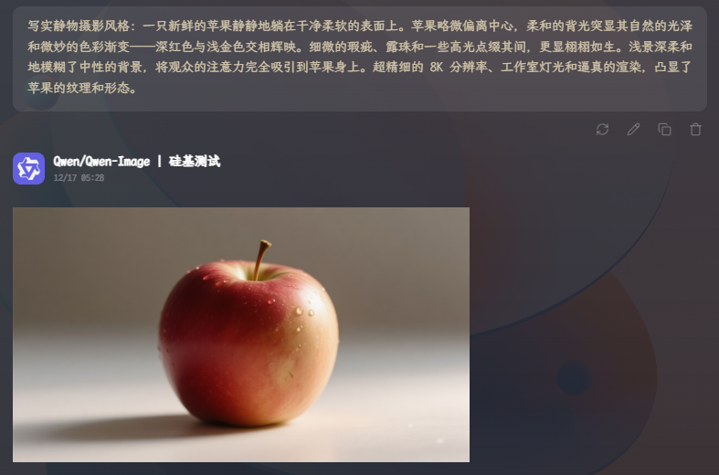
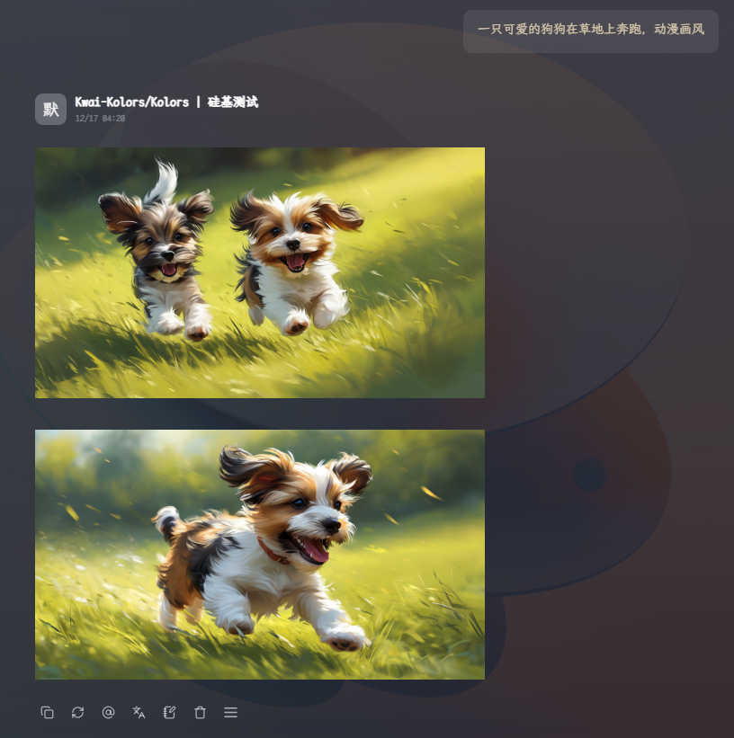
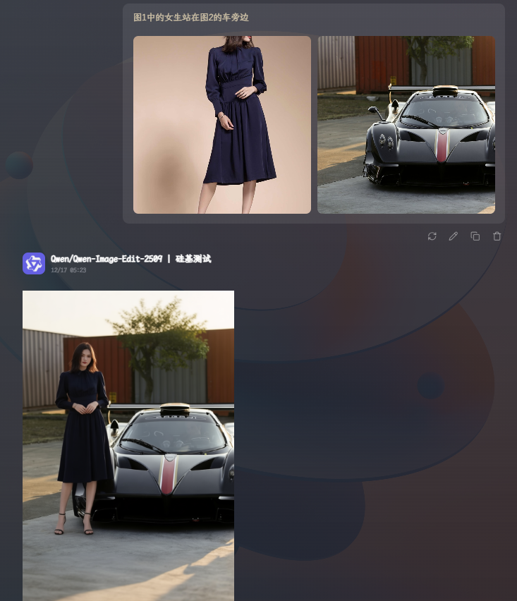
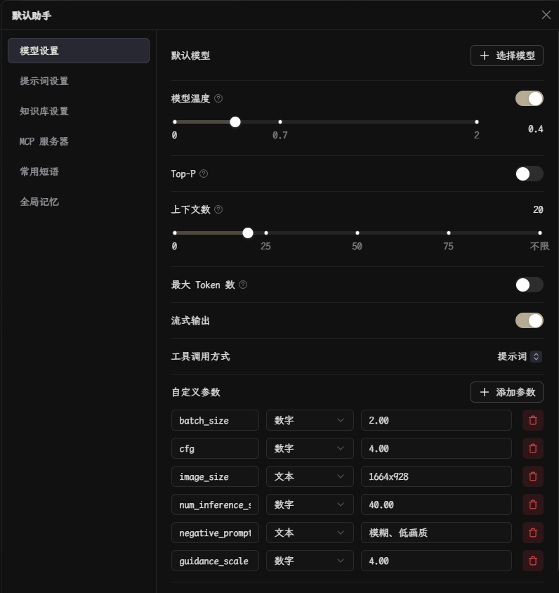

# SiliconFlow Image to OpenAI

一个将 SiliconFlow 图像生成 API 适配为 OpenAI 格式的代理服务。通过此 python 脚本，您可以使用熟悉的 OpenAI 格式来调用 SiliconFlow 的图像生成服务。

> [!WARNING]
> 当前脚本支持 [siliconflow.cn](https://www.siliconflow.cn)（中国国内站点）
> 尚未测试过 [siliconflow.com](https://www.siliconflow.com)（国际站），请自行测试！

> [!TIP]
> 除了 Python 版本外，本项目还提供了 Cloudflare Worker 版本（`worker.js`），可以直接部署到 [Cloudflare Workers](https://dash.cloudflare.com)，无需自建服务器，使用更加方便。

## 支持的模型

| 模型 | 可用参数 |
|---|---|
| Qwen/Qwen-Image-Edit-2509 | prompt, negative_prompt, seed, num_inference_steps, image, image2, image3 |
| Qwen/Qwen-Image-Edit | prompt, negative_prompt, seed, num_inference_steps, image |
| Qwen/Qwen-Image | prompt, negative_prompt, image_size, seed, num_inference_steps, cfg |
| Kwai-Kolors/Kolors | prompt, negative_prompt, image_size, batch_size, seed, num_inference_steps, guidance_scale |

## 模型参数官方说明

> [!IMPORTANT]
> 以下 siliconflow 的模型参数通过请求体传递，但 `prompt` 和图像参数（`image`、`image2`、`image3`）是通过提取 `messages` 中的最后一条用户消息内容和 `image_url` 中的内容，不是直接的 API 参数：
> - `prompt`：通过 messages 中的最后一条用户消息内容提取
> - `image/image2/image3`：通过 messages 中的 image_url 类型消息提取
> - 支持流式和非流式调用，可通过设置 `"stream": true` 参数启用流式输出模式

| 参数 | 类型 | 说明 | 值 |
|---|---|---|---|
| negative_prompt | string | 负面提示词 | - |
| image_size | string | 图像分辨率（宽x高）（仅适用于Qwen/Qwen-Image和Kwai-Kolors/Kolors） | Kolor模型推荐：1024x1024, 960x1280, 768x1024, 720x1440, 720x1280<br><br>Qwen-Image模型推荐：1328x1328, 1664x928, 928x1664, 1472x1140, 1140x1472, 1584x1056, 1056x1584 |
| batch_size | integer | 输出图像数量（仅适用于Kwai-Kolors/Kolors） | 默认：1，范围：1-4 |
| seed | integer | 随机种子 | 范围：0-9999999999 |
| num_inference_steps | integer | 推理步数 | 默认：20，范围：1-50 |
| guidance_scale | number | 控制生成的图像与给定提示之间的匹配程度（仅适用于Kwai-Kolors/Kolors） | 默认：7.5，范围：0-20 |
| cfg | number | 调整生成的输出与输入提示的紧密程度（仅适用于Qwen/Qwen-Image模型） | 范围：0.1-20 |

## 调用示例

### 1. Qwen/Qwen-Image

```bash
curl -X POST http://localhost:8000/v1/chat/completions \
  -H "Authorization: Bearer YOUR_API_KEY" \
  -H "Content-Type: application/json" \
  -d '{
    "model": "Qwen/Qwen-Image",
    "messages": [
      {
        "role": "user",
        "content": "写实静物摄影风格：一只新鲜的苹果静静地躺在干净柔软的表面上。苹果略微偏离中心，柔和的背光突显其自然的光泽和微妙的色彩渐变——深红色与浅金色交相辉映。细微的瑕疵、露珠和一些高光点缀其间，更显栩栩如生。浅景深柔和地模糊了中性的背景，将观众的注意力完全吸引到苹果身上。超精细的 8K 分辨率、工作室灯光和逼真的渲染，凸显了苹果的纹理和形态。"
      }
    ],
    "image_size": "1024x1024",
    "guidance_scale": 7.5,
    "num_inference_steps": 30,
    "negative_prompt": "低质量, 模糊",
    "seed": 42
  }'
```

**响应：**
```json
{
  "id": "chatcmpl-5c4dc934fb524d1ba206483b1d66d26b",
  "object": "chat.completion",
  "created": 1765924089,
  "model": "Qwen/Qwen-Image",
  "choices": [
    {
      "index": 0,
      "message": {
        "role": "assistant",
        "content": ""
      },
      "finish_reason": "stop"
    }
  ],
  "usage": {
    "prompt_tokens": 1,
    "completion_tokens": 1,
    "total_tokens": 2
  }
}
```



### 2. Kwai-Kolors/Kolors

```bash
curl -X POST http://localhost:8000/v1/chat/completions \
  -H "Authorization: Bearer YOUR_API_KEY" \
  -H "Content-Type: application/json" \
  -d '{
    "model": "Kwai-Kolors/Kolors",
    "messages": [
      {
        "role": "user",
        "content": "一只可爱的狗狗在草地上奔跑，动漫画风"
      }
    ],
    "image_size": "1024x1024",
    "guidance_scale": 8.0,
    "seed": 42,
    "batch_size": 2
  }'
```



### 3. Qwen/Qwen-Image-Edit-2509

```bash
curl -X POST http://localhost:8000/v1/chat/completions \
  -H "Authorization: Bearer YOUR_API_KEY" \
  -H "Content-Type: application/json" \
  -d '{
    "model": "Qwen/Qwen-Image-Edit-2509",
    "cfg": 4,
    "num_inference_steps": 40,
    "messages": [
      {
        "role": "system",
        "content": "我是一个综合智能 AI 助手。"
      },
      {
        "role": "user",
        "content": [
          {
            "type": "text",
            "text": "图1中的女生站在图2的车旁边"
          },
          {
            "type": "image_url",
            "image_url": {
              "url": "data:image/png;base64,..."
            }
          },
          {
            "type": "image_url",
            "image_url": {
              "url": "data:image/png;base64,..."
            }
          }
        ]
      }
    ],
    "stream": true
  }'
```



## Cherry Studio 中使用

1. 运行`main.py`
2. 在设置中添加新渠道，填写 API 地址为 `http://localhost:8000`，API 密钥为硅基流动官方的密钥
3. 点击`管理`，并添加模型（项目实现了模型列表接口）
4. 选择模型并发送对话/图片
5. 如需添加参数，右键`助手`编辑，在`自定义参数`中添加参数



使用时只要图片数量正确，如果使用了模型不支持的参数不会报错，硅基流动会自动忽略多余参数。

## 贡献

欢迎提交 Issue 和 Pull Request！

## 许可证

MIT License - 详见 [LICENSE](LICENSE) 文件
